# **bvm.org.ar**
[Página web](https://bvm.org.ar) orientada a la administración y centralización de datos de un cuartel de bomberos.

## **Objetivo:**
* Registrar los datos de los usuarios para su uso correcto a lo largo del tiempo, garantizando su almacenamiento y disponibilidad.
* Centralizar las herramientas de los usuarios, desde formularios y capacitación hasta estadísticas, entre otros.
* Modernizar a la institución, reemplazando el papel por una interfaz accesible desde cualquier lugar.

## **Funcionalidades:**
- [Seguridad con usuario y contraseña](#Login)
- [Perfil de usuario](#Perfil)
- [Formularios](#Formularios)
- [Herramientas](#Herramientas)
- [Personal](#Personal)
- [Aula Virtual](#Aula-Virtual)
- [Organigrama](#Organigrama)
- [Contactos de Emergencia](#Contactos-Emergencia)
- [Otros](#Otros)
- [Lector NFC](#Lector-NFC)
- [Stack Tecnológico](#Stack-Tecnológico)

---

## **Login**
    Cada persona cuenta con un nombre de usuario y contraseña, requisito indispensable para acceder al sitio.

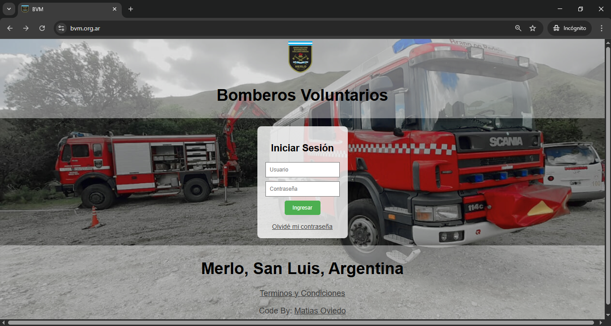 

* Cuando se crea un perfil se habilita el acceso al login generando una contraseña genérica, que el usuario modifica al ingresar por primera vez.

---

## **Perfil**

    Al iniciar sesión con sus credenciales, cada usuario accede a su perfil, donde encuentra lo siguiente:
* Estadísticas de intervenciones
    - Extraídas directamente de RUBA con actualización semanal
* Estadísticas de presentismo
    - Datos propios del lector NFC
* Datos personales
    - Información editable por el propio usuario o por el personal de Legajos
* Certificados
    - Cualquier certificado que el usuario suba al sistema
* Botones habilitados
    - Según los permisos, dispondrá de distintos accesos, como aulas para bomberos, cadetes o ingresantes

#### Visualización de datos:
    Cada usuario puede consultar todos sus datos en esta sección. También pueden hacerlo los supervisores habilitados, como jefes, oficiales o encargados, según corresponda.

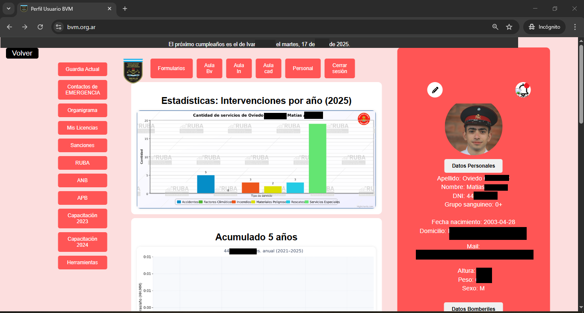
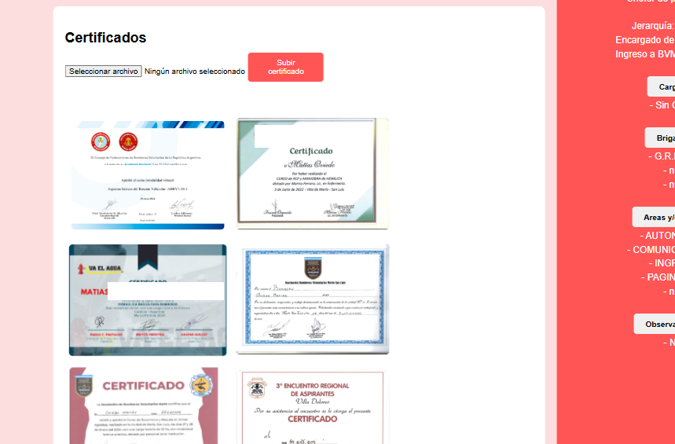

---

## **Formularios:**
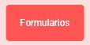

    Aquí se concentran todos los formularios disponibles en el sistema. Fueron desarrollados según las necesidades de la institución.

    Si la cantidad de formularios es elevada, pueden filtrarse mediante botones ubicados a la izquierda.

#### Ejemplo:
**Formulario de Licencias:** el usuario puede solicitar licencias o vacaciones. Al enviarlo, los jefes reciben una solicitud para su aprobación.

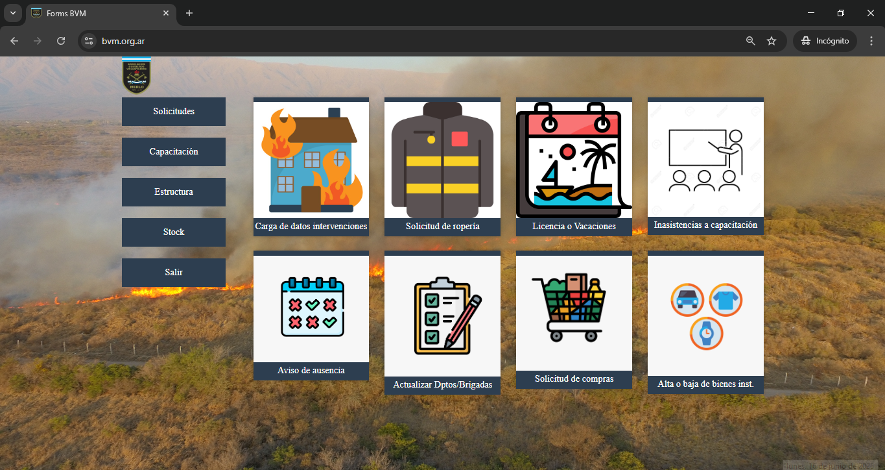

---

## **Herramientas:**
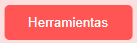

    El sitio cuenta con diversas herramientas internas habilitadas según los permisos de cada usuario

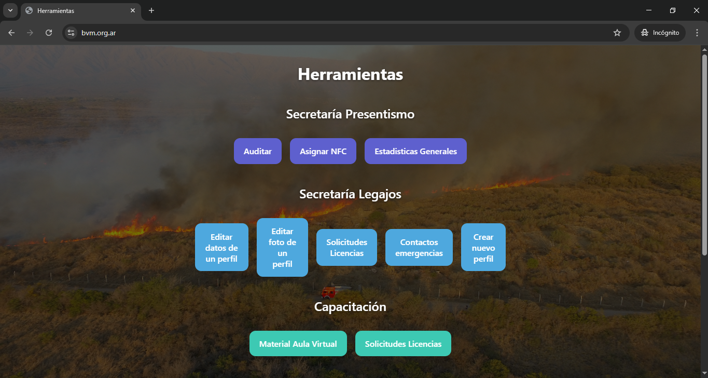

#### Ejemplo:
**Panel de Ropería:** permite al jefe visualizar y gestionar las solicitudes. Todas quedan registradas y pueden filtrarse por **pendientes** (todas las gestiones comparten el mismo formato)

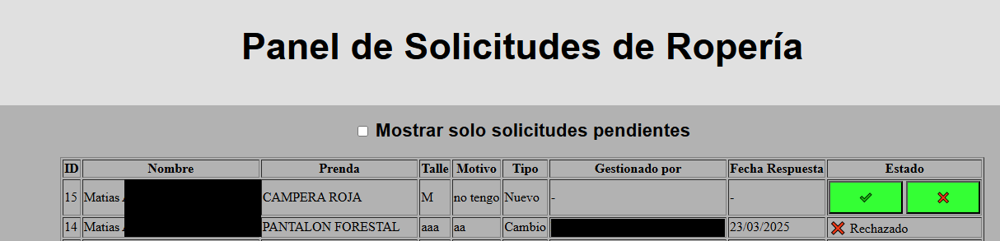

---

## **Personal:**
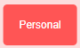

    Desde esta función, los supervisores pueden visualizar todos los perfiles, filtrando por tipo de usuario y su condición.

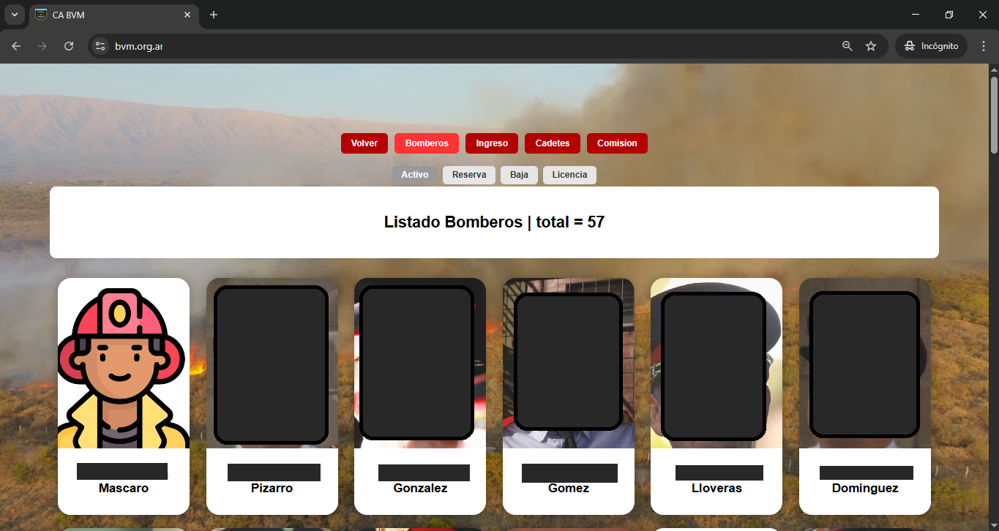

---

## **Aula:**
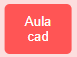

    El sistema cuenta con un aula virtual que separa el contenido según los distintos niveles, como Cadetes, Bomberos o Ingresantes.

    Se pueden subir PDF, videos y cualquier material útil para visualizar directamente desde la página web.

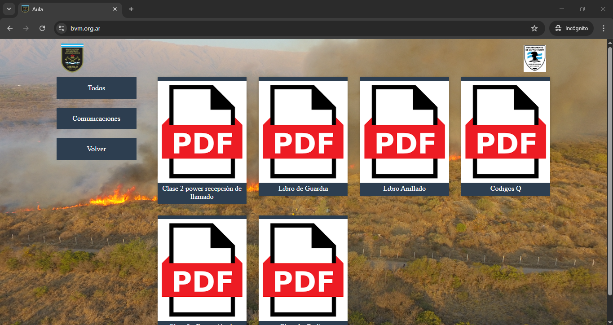

---

## **Organigrama:**
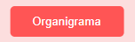

    En base a los datos registrados en el formulario "actualizar brigadas y departamentos" se genera un organigrama visual para observar la distribución interna de la institución, facilitando una fácil interpretación del personal.
* Gráfico interactivo:
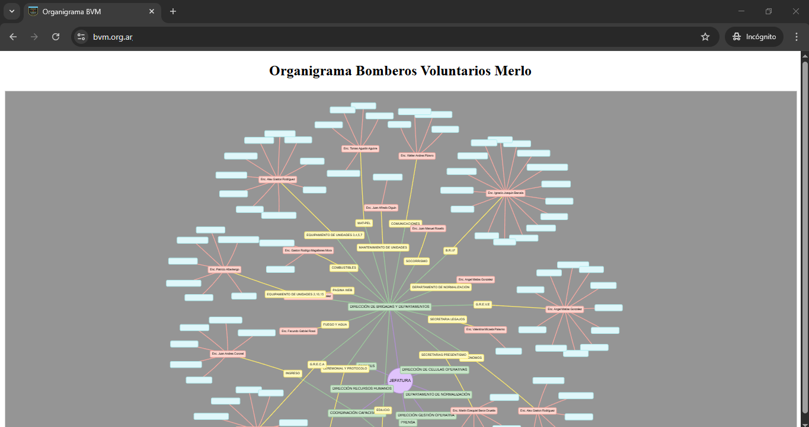

---

## **Contactos de emergencia:**
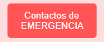

    Cada usuario actualiza sus contactos de emergencia para cualquier situación. Esta información puede ser consultada por cualquier usuario.

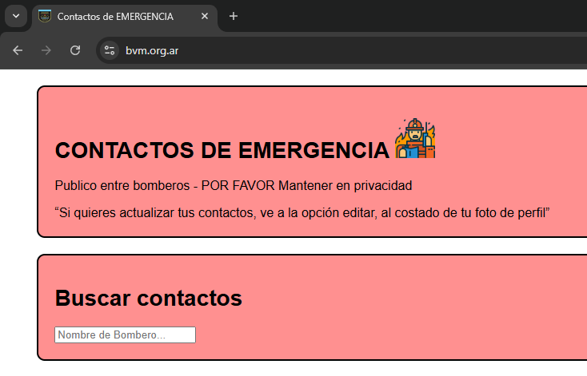

---

## **Otros:**
    Existen otras funciones para visualizar datos personales o redirigir a sitios de interés.

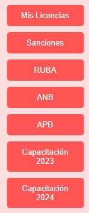

---

## **Lector NFC:**

    Recientemente hemos reemplazado el libro de ingreso y salida del personal por un lector digital desarrollado específicamente para la página. Esto ha ahorrado aproximadamente 30 horas mensuales de carga manual en RUBA.

    Se instaló en el ingreso a la institución un lector donde se registra el ingreso y la salida.

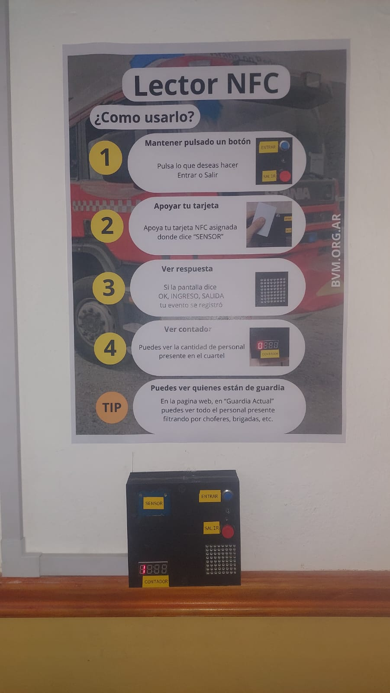

* Cada usuario dispone de una tarjeta, llavero o celular con NFC y registra su presencia rápidamente.
* Los registros pueden ser auditados por quienes estén autorizados y posteriormente se cargan automáticamente a RUBA, ahorrando muchas horas de carga manual.
* Visualización de la guardia en tiempo real con las siguientes ventajas:
    * Visualización rápida de nombres con foto de perfil
    * Contador de choferes tipo liviana y pesada
    * Contador de las brigadas presentes.

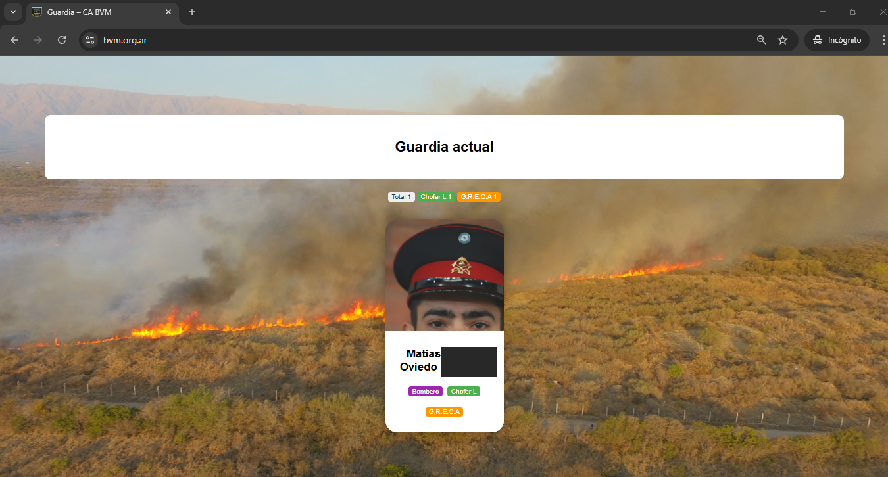

---

## 📦 **Stack Tecnológico**

## **Contacto:**
### Consultá por una versión personalizada para tu institución
: [matiasalbertooviedogonzalez@gmail.com](mailto:matiasalbertooviedogonzalez@gmail.com)

: Merlo, San Luis, Argentina
